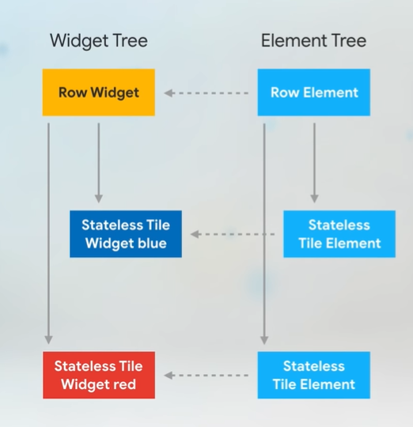
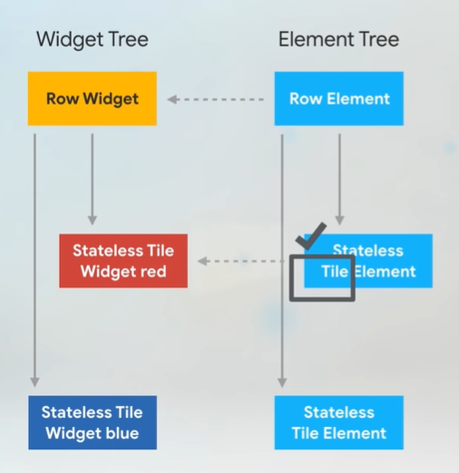
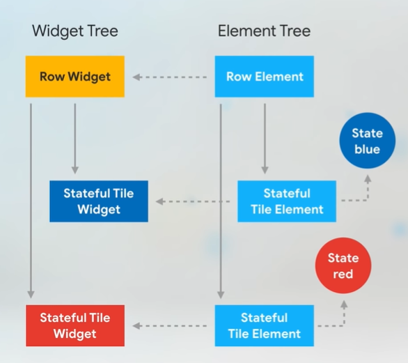
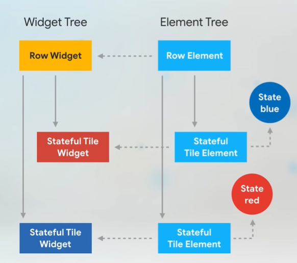
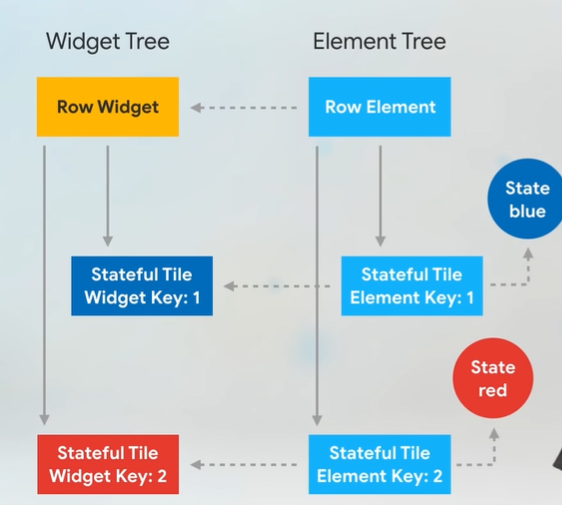
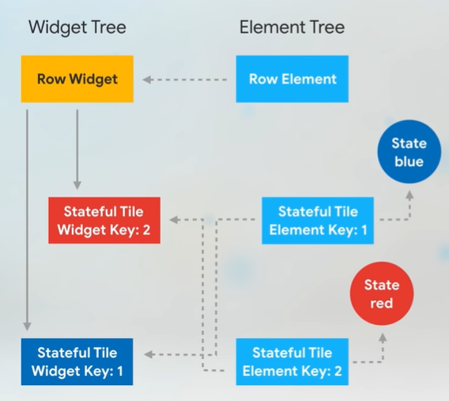
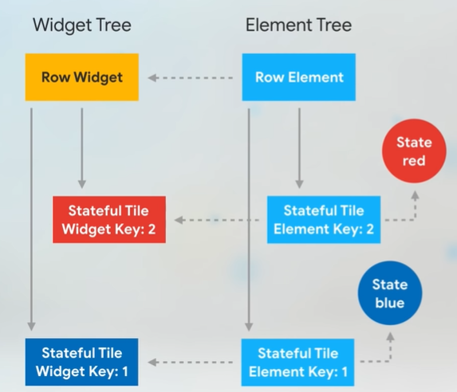

- RenderObject: compute and descripe the geometry of the widget

- The widget's main job is to implement a `build()` function

#### In pubspec.yaml

- ```yaml
  name: my_app
  flutter:
    uses-material-design: true
  ```

- `uses-material-design: true`  allow to use a set of [Material icons](https://design.google.com/icons/). 

#### Layout

- View more [Layouts](https://docs.flutter.dev/development/ui/widgets/layout).

#### Material Components

- View more [Material Components widgets](https://docs.flutter.dev/development/ui/widgets/material).

#### Deeper in widget

- **Stateless widget**:
  
  - Receive arguments from their parent widget.
  
  - The member variables are [final](https://dart.dev/guides/language/language-tour#final-and-const).

- **Stateful widget**:
  
  - Generate **State** object, which hold state.
  
  - **StatefulWidget** and **State** are two types of different objects.
    
    - **Widget** is temporary object, construct a presentation of current state
    
    - **State** calls `build()` continuously, allow to remember information
  
  - When **StatefulWidget** is inserted into the tree, framework calls the [createState()](https://api.flutter.dev/flutter/widgets/StatefulWidget-class.html#createState) function to create a fresh instance of **State** to associate with that location in the tree. So that, when parent rebuilds, the parent create a new instance of **StatefulWidget** but reuses **State** is already in the tree rather than calling `createState` again.
  
  - To access properties of **StatefulWidget**, **State** use `widget` property. 
  
  - If you wish to be notified when the `widget` property changes, override the [didUpdateWidget()](https://api.flutter.dev/flutter/widgets/State-class.html#didUpdateWidget) function, which is passed an `oldWidget` to let you compare the old widget with the current widget.
  
  - Use [setState()](https://api.flutter.dev/flutter/widgets/State/setState.html) to signal to framework about the changed state

- Use **callback** to change notification flow "up" the widget hierarchy

- Flow "down" to do presentation. View more [Introduction to widgets | Flutter](https://docs.flutter.dev/development/ui/widgets-intro#:~:text=In%20Flutter%2C%20change%20notifications%20flow%20%E2%80%9Cup%E2%80%9D%20the%20widget%20hierarchy%20by%20way%20of%20callbacks).

- Lifecycle:
  
  - After calling [createState()](https://api.flutter.dev/flutter/widgets/StatefulWidget-class.html#createState) on the `StatefulWidget`, the framework inserts the new state object into the tree and then calls [initState()](https://api.flutter.dev/flutter/widgets/State-class.html#initState) on the state object
  
  - `initState()` use to configure animations or to subscribe to platform services, something happen just once. Implementations of `initState` are required to start by calling `super.initState`.
  
  - When a state object is no longer needed, the framework calls [`dispose()`](https://api.flutter.dev/flutter/widgets/State-class.html#dispose) to do cleanup work such as cancel timers or to unsubscribe from platform services. Implementations of `dispose` typically end by calling `super.dispose`.

- View more [State](https://api.flutter.dev/flutter/widgets/State-class.html).

#### Key

- A [Key](https://api.flutter.dev/flutter/foundation/Key-class.html) is an identifier for [Widget](https://api.flutter.dev/flutter/widgets/Widget-class.html)s, [Element](https://api.flutter.dev/flutter/widgets/Element-class.html)s and [SemanticsNode](https://api.flutter.dev/flutter/semantics/SemanticsNode-class.html)s.

- Framework matches widgets in the current and previous build according to their [runtimeType](https://api.flutter.dev/flutter/widgets/Widget-class.html#runtimeType) and the order in which they appear. The same [key](https://api.flutter.dev/flutter/foundation/Key-class.html) 

- If key is not used, framework check type.

- Should use when you find adding, removing, or reordering collection of widgets of the same type

- If the entire widget subtree in collection is **StatelessWidget**, key **aren't** needed. Use in **StatefulWidget**.
  
  - In **StatelessWidget**, for every widget have a corresponding **element** - hold information about type of each widget and reference to children elements (skeleton). 
  
  - When wrap order of **StatelessWidget**, Flutter walk the element tree, and check the new widget is the same type and key as the old one => it updates reference to the new widget
  
  - In **StatefulWidget**, widget has the **State** object and the color information is stored in **State**, not in widget. 
  
  - So when swap order of widget, Flutter check the type of **StatefulWidget** is the same type and update reference to the new widget (not it's **State**).
  
  - With **Key**, Flutter check that the key of **element** doesn't match the key of **StatefulWidget**. So that, Flutter deactivates and moving the reference to **element** in element tree. 
  
  - When it finds a match, update the reference to the corresponding widget.
  
  - Then swapping places and updating **State**
    
    

#### Widget

- Describes the configuration for an [Element](https://api.flutter.dev/flutter/widgets/Element-class.html).

- Widget is an immutable.

- Widgets themselves have no mutable state.

- All fields must be final
  
  - The **key** property: controls how one widget replaces another widget in the tree. If the [runtimeType](https://api.flutter.dev/flutter/dart-core/Object/runtimeType.html) and [key](https://api.flutter.dev/flutter/widgets/Widget/key.html) properties of the two widgets are [operator==](https://api.flutter.dev/flutter/widgets/Widget/operator_equals.html), then the new widget replaces the old widget by updating the **element** (by calling [Element.update](https://api.flutter.dev/flutter/widgets/Element/update.html) with the new widget)
  
  - Otherwise, the old **element** is removed from the tree, the new **widget** is inflated (gắn) into an **element**, and the new element is inserted into the tree

#### Element

- An instantiation (khởi tạo) of a [Widget](https://api.flutter.dev/flutter/widgets/Widget-class.html) at a particular location in the tree.

- Represent the widget's specific location in the tree

- Lifecycle:
  
  - Framework creates an element by calling [Widget.createElement](https://api.flutter.dev/flutter/widgets/Widget/createElement.html) on the widget that will be used as the element's initial configuration.
  
  - Framework calls [mount](https://api.flutter.dev/flutter/widgets/Element/mount.html) to add the created element to the tree for the first time at a given slot in a given parent. The [mount](https://api.flutter.dev/flutter/widgets/Element/mount.html) method is responsible for inflating any child widgets and calling [attachRenderObject](https://api.flutter.dev/flutter/widgets/Element/attachRenderObject.html) as necessary to attach any associated render objects to the render tree.
    
    - [mount method](https://api.flutter.dev/flutter/widgets/Element/mount.html) : transitions the **element** from the "initial" lifecycle state to the "active" lifecycle state
  
  - At this point, the element is considered "active" and might appear on screen.
  
  - If parent is rebuilt with new state, Flutter call Element.[update](https://api.flutter.dev/flutter/widgets/Element/update.html) with the new widget (new widget has the same **runtimeType** and **key** as old widget). Else if parent wishes to change the runtimeType or key, let unmount this element and inflating the new widget at this location.
  
  - If an ancestor remove this element from tree, ancestor call [deactivateChild](https://api.flutter.dev/flutter/widgets/Element/deactivateChild.html) on itself. Add this element to the [owner](https://api.flutter.dev/flutter/widgets/Element/owner.html)'s list of inactive elements
  
  - At this point, the element is considered "inactive" and will not appear on screen. An element can remain in the inactive state only until the end of the current animation frame. At the end of the animation frame, any elements that are still inactive will be unmounted.
  
  - If the element gets reincorporated (hợp lại) into the tree, framework removes the element from the [owner](https://api.flutter.dev/flutter/widgets/Element/owner.html)'s list of inactive elements, call [activate](https://api.flutter.dev/flutter/widgets/Element/activate.html) on the element, and reattach the element's render object to the render tree. (The element is again considered "active" and might appear on screen.)
  
  - Otherwise, the element is considered "defunct" and will not be incorporated into the tree in the future.

#### Render Object

#### StatefulWidget

- A widget that has mutable state

- State is information
  
  - Can be read synchronously when the widget is built
  
  - Might change during the lifetime of the widget

- Minimize the impact of rebuilding a stateful widget:
  
  - Push the state to the leaves
  
  - Minimize the number of nodes transitively created by the build method and any widgets it creates
  
  - If a subtree does not change, cache the widget that represents that subtree and re-use it each time it can be used by assign a widget to a `final` state variable and re-use it in the build method
  
  - Use `const` widgets where possible. (This is equivalent to caching a widget and re-using it.)
  
  - Avoid changing the depth of any created subtrees or changing the type of any widgets in the subtree
  
  - If the depth must be changed for some reason, consider wrapping the common parts of the subtrees in widgets that have a [GlobalKey](https://api.flutter.dev/flutter/widgets/GlobalKey-class.html) that remains consistent for the life of the stateful widget
  
  - Use Widget instead the method return a Widget

#### State

- The state of **StatefulWidget**

- Lifecycle:
  
  - **State** is created by calling **StatefulWidget.createState()**
  
  - The newly **State** is associated with a **BuildContext** (consider **State** object is mounted). **State** never change **BuildContext**. **BuildContext** can be moved in tree with its subtree
  
  - Flutter call [initState](https://api.flutter.dev/flutter/widgets/State/initState.html) (subclasses of State override initState to perform one-time initialization), at this point, context and widget properties of State is avaiable.
  
  - Then call  [didChangeDependencies](https://api.flutter.dev/flutter/widgets/State/didChangeDependencies.html) (subclasses of State override didChangeDependencies to perform initialization involving [InheritedWidget](https://api.flutter.dev/flutter/widgets/InheritedWidget-class.html)). If [BuildContext.dependOnInheritedWidgetOfExactType](https://api.flutter.dev/flutter/widgets/BuildContext/dependOnInheritedWidgetOfExactType.html) is called, the [didChangeDependencies](https://api.flutter.dev/flutter/widgets/State/didChangeDependencies.html) method will be called again if the inherited widgets change or if the widget moves in the tree
  
  - Now, after initialized,  Flutter can call [build](https://api.flutter.dev/flutter/widgets/State/build.html) method any number of times to description UI
  
  - During this time, when parent widget rebuild => request a new widget with the same [runtimeType](https://api.flutter.dev/flutter/dart-core/Object/runtimeType.html) and [Widget.key](https://api.flutter.dev/flutter/widgets/Widget/key.html). Then Flutter update [widget](https://api.flutter.dev/flutter/widgets/State/widget.html) property and call [didUpdateWidget](https://api.flutter.dev/flutter/widgets/State/didUpdateWidget.html) method with the previous widget as an argument.  [State](https://api.flutter.dev/flutter/widgets/State-class.html) objects should override [didUpdateWidget](https://api.flutter.dev/flutter/widgets/State/didUpdateWidget.html) to respond to changes in their associated widget (e.g., to start implicit animations). The framework always calls [build](https://api.flutter.dev/flutter/widgets/State/build.html) after calling [didUpdateWidget](https://api.flutter.dev/flutter/widgets/State/didUpdateWidget.html), which means any calls to [setState](https://api.flutter.dev/flutter/widgets/State/setState.html) in [didUpdateWidget](https://api.flutter.dev/flutter/widgets/State/didUpdateWidget.html) are redundant.
  
  - If hot reload occurs, reinitialize any data that was prepared in the [initState](https://api.flutter.dev/flutter/widgets/State/initState.html) method
  
  - If the subtree containing the [State](https://api.flutter.dev/flutter/widgets/State-class.html) object is removed from the tree (maybe difference between runtimeType and key), call [deactivate](https://api.flutter.dev/flutter/widgets/State/deactivate.html) method. Maybe inserted again in tree
  
  - Otherwise, call [dispose](https://api.flutter.dev/flutter/widgets/State/dispose.html),  [State](https://api.flutter.dev/flutter/widgets/State-class.html) object will never build again
  
  - Then, the [State](https://api.flutter.dev/flutter/widgets/State-class.html) object is considered unmounted and the [mounted](https://api.flutter.dev/flutter/widgets/State/mounted.html) property is false. It is an error to call [setState](https://api.flutter.dev/flutter/widgets/State/setState.html)

#### InheritedWidget

- Base class for widgets that efficiently data transmission down the tree.

- To get the **nearest** instance of a particular type of inherited widget from a build context, use [BuildContext.dependOnInheritedWidgetOfExactType](https://api.flutter.dev/flutter/widgets/BuildContext/dependOnInheritedWidgetOfExactType.html).
  
  - Don't use the method in [State.initState](https://api.flutter.dev/flutter/widgets/State/initState.html) (call once)
  
  - Should use in from build methods, layout and paint callbacks, or from [State.didChangeDependencies](https://api.flutter.dev/flutter/widgets/State/didChangeDependencies.html) to ensure *the widget correctly updates itself when the inherited value changes*

- ```dart
  class FrogColor extends InheritedWidget {
    const FrogColor({
      super.key,
      required this.color,
      required super.child,
    });
  
    final Color color;
  
    static FrogColor of(BuildContext context) {
      final FrogColor? result = context.dependOnInheritedWidgetOfExactType<FrogColor>();
      assert(result != null, 'No FrogColor found in context');
      return result!;
    }
  
    @override
    bool updateShouldNotify(FrogColor old) => color != old.color;
  }
  ```

- Implement
  
  ```dart
  class MyPage extends StatelessWidget {
    const MyPage({super.key});
  
    @override
    Widget build(BuildContext context) {
      return Scaffold(
        body: FrogColor(
          color: Colors.green,
          child: Builder(
            builder: (BuildContext innerContext) {
              return Text(
                'Hello Frog',
                style: TextStyle(color: FrogColor.of(innerContext).color),
              );
            },
          ),
        ),
      );
    }
  }
  ```
  
  - [Builder](https://api.flutter.dev/flutter/widgets/Builder-class.html): the widget is a simple way to define a **StatelessWidget** inline
    
    - ```dart
      //the normal way to create a StatelessWidget
      class Foo extends StatelessWidget {
        @override
        Widget build(BuildContext context) => Text('foo');
      }
      
      Center(child: Foo())
      //The alternative way by using Builder
      Center(
        child: Builder(
          builder: (BuildContext context) => Text('foo');
        ),
      )
      ```
  
  - When use Builder, `FrogColor` have a child widget and child context and you can get the color of `FrogColor` from that child widget by `FrogColor.of(innerContext).color`
